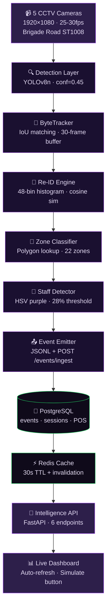
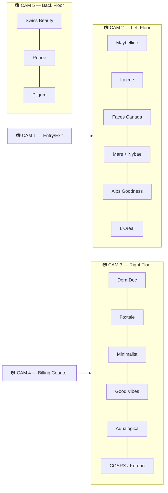

# Store Intelligence Platform
### Real-time CCTV Analytics for Purplle · Brigade Road Bangalore (ST1008)

> Transforms raw CCTV footage into live retail metrics — conversion rate, zone heatmaps, queue alerts, and a live dashboard. Built end-to-end from detection to API to UI.

---

## 🗺️ System Architecture



---

## 🔄 Event Flow

```mermaid
flowchart LR
    Frame[<b>Video Frame</b><br/>1920×1080] --> Det[<b>Detect</b><br/>YOLOv8n]
    Det --> Track[<b>Track</b><br/>ByteTracker]
    Track --> ReID[<b>Re-ID</b><br/>visitor_id]
    ReID --> Zone[<b>Zone</b><br/>polygon match]
    Zone --> Emit[<b>Emit Event</b><br/>JSONL]
    Emit --> Ingest[<b>POST /ingest</b><br/>≤500 per batch]
    Ingest --> DB[(PostgreSQL)]
    DB --> API[<b>REST API</b><br/>metrics · funnel · heatmap]
    API --> Dash[<b>Dashboard</b><br/>live update 5s]

    classDef purple fill:#2d1f4a,stroke:#a855f7,color:#e2d9f3
    classDef green fill:#0f2010,stroke:#22c55e,color:#e2d9f3
    class Frame,Det,Track,ReID,Zone,Emit,Ingest purple
    class DB,API,Dash green
```



---

## 🚀 Quick Start

```bash
# 1 — Clone
git clone https://github.com/Pragati1466/Pragati_Purplletechchallenge.git
cd Pragati_Purplletechchallenge

# 2 — Start everything (API + PostgreSQL + Redis + real data auto-seeded)
docker compose up -d

# 3 — Check it's alive
curl http://localhost:8000/health

# 4 — Open dashboard
open http://localhost:8000/dashboard
```

> The `seeder` container auto-runs on startup and populates the database with 24 real Brigade Road POS transactions and ~120 synthetic visitor sessions. Dashboard has live data immediately.

---

## 📡 API Endpoints

| Endpoint | What it returns |
|---|---|
| `POST /events/ingest` | Ingest up to 500 events — idempotent, partial success per event |
| `GET /stores/ST1008/metrics` | Unique visitors, conversion rate, queue depth, abandonment rate |
| `GET /stores/ST1008/funnel` | Entry → Zone Visit → Billing → Purchase with drop-off % |
| `GET /stores/ST1008/heatmap` | Zone visit frequency + dwell, normalised 0–100 |
| `GET /stores/ST1008/anomalies` | BILLING_QUEUE_SPIKE · CONVERSION_DROP · DEAD_ZONE with severity |
| `GET /health` | DB status · per-store lag · STALE_FEED warning if >10 min |

Interactive docs → **http://localhost:8000/docs**

---

## 🗂️ Store Zones — Brigade Road



---

## 📦 Repo Structure

```
store-intelligence/
├── pipeline/
│   ├── detect.py          ← YOLOv8n + ByteTracker + Re-ID
│   ├── tracker.py         ← custom ByteTrack (pure Python)
│   ├── reid.py            ← histogram Re-ID engine
│   ├── zone_classifier.py ← polygon point-in-polygon
│   ├── staff_detector.py  ← HSV purple detection
│   ├── emit.py            ← event schema + JSONL writer
│   └── run.sh             ← one command for all 5 cameras
├── app/
│   ├── main.py            ← FastAPI app + middleware + handlers
│   ├── ingestion.py       ← POST /events/ingest (partial success)
│   ├── metrics.py         ← GET /metrics (Redis cached)
│   ├── funnel.py          ← GET /funnel (session-based)
│   ├── heatmap.py         ← GET /heatmap (normalised 0-100)
│   ├── anomalies.py       ← GET /anomalies (3 types, tiered severity)
│   ├── health.py          ← GET /health (stale feed detection)
│   ├── models.py          ← Pydantic event schema
│   └── database.py        ← SQLAlchemy async (PG + SQLite)
├── dashboard/
│   └── index.html         ← live dashboard (auto-refresh + simulate)
├── data/
│   ├── store_layout.json  ← 22 zones across 5 cameras
│   ├── pos_transactions.csv ← 24 real Brigade Road transactions
│   └── init_real_data.py  ← seeds DB with real data on startup
├── tests/                 ← 94 tests · 67.8% coverage
├── docs/
│   ├── DESIGN.md          ← architecture + AI-assisted decisions
│   └── CHOICES.md         ← 4 decisions with AI vs my choice
├── docker-compose.yml
├── Dockerfile.api
└── init.sql
```

---

## 🧪 Tests

```bash
pip install -r requirements.txt
python -m pytest tests/ -q
# 94 passed · 67.8% coverage
```

Edge cases covered: empty store · all-staff clip · zero purchases · re-entry deduplication · idempotency · partial success · 503 on DB failure · stale feed detection

---

## 🏗️ Key Engineering Decisions

| Decision | AI Suggested | I Chose | Why |
|---|---|---|---|
| Detection model | YOLOv9t (accuracy) | **YOLOv8n** | 45 FPS vs 28 FPS matters more than 0.9% mAP gain |
| Re-ID | OSNet | **Histogram + time gap** | Face blur makes appearance Re-ID hard; histograms work fine on 5-cam single store |
| Caching | Materialized views | **Redis 30s TTL + invalidation** | No pg_cron dependency; avg staleness 8s vs fixed 30s |
| Partial ingest | Request-level Pydantic | **Per-event validation** | One bad event in 500 shouldn't reject the other 499 |

Full reasoning → [docs/CHOICES.md](docs/CHOICES.md)  
Architecture deep-dive → [docs/DESIGN.md](docs/DESIGN.md)

---

## 📊 Real Data — Brigade Road Bangalore

| Field | Value |
|---|---|
| Store ID | `ST1008` |
| Date | 10 April 2026 |
| Transactions | 24 orders · ₹44,920 GMV |
| Top brands | Faces Canada · Good Vibes · DermDoc · Minimalist · COSRX |
| Operating window | 12:15 – 21:40 |
| Zones | 22 named (from real store layout) |

---

## 🛠️ Tech Stack

| Layer | Tech |
|---|---|
| Detection | YOLOv8n (Ultralytics) · OpenCV · NumPy |
| Tracking | Custom ByteTrack (pure Python/NumPy) |
| API | FastAPI · SQLAlchemy 2.0 async · Pydantic v2 |
| Database | PostgreSQL 15 (production) · SQLite (tests) |
| Cache | Redis 7 |
| Logging | structlog (JSON · trace_id on every request) |
| Dashboard | Vanilla JS · auto-poll · no framework |
| Tests | pytest · pytest-asyncio · aiosqlite |
| Container | Docker Compose (api + db + redis + seeder) |

---

## 🎬 Detection Pipeline — Running on Real Footage

```bash
# Install dependencies
pip install -r requirements.txt

# Process all 5 cameras and stream events to API
./pipeline/run.sh http://localhost:8000

# Or simulate real-time replay of existing events
python pipeline/simulate_realtime.py --speed 10
```

---

**Purplle Tech Challenge 2026 · Round 2**
